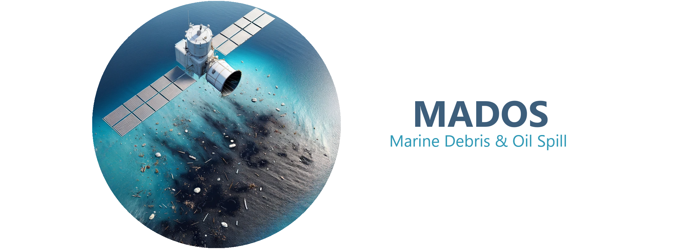

[[`paper`](https://www.sciencedirect.com/science/article/pii/S0924271624000625)][[`project page`](https://marine-pollution.github.io/)][[`dataset`](https://zenodo.org/records/10664073)]

This project is a fork of the Marine Debris and Oil Spill (MADOS) dataset repository, focusing on marine litter and oil spills. Other sea surface features that coexist with or have been suggested to be spectrally similar to them have also been considered. MADOS formulates a challenging semantic segmentation task using sparse annotations.

In order to download MADOS go to https://doi.org/10.5281/zenodo.10664073.

This fork enhances the project by providing a Dockerized version, enabling easy deployment, in this case on Runpod Serverless.

## Installation
To facilitate easy deployment, this fork includes a Dockerized version. You can pull and run the Docker container locally or deploy it using Docker Hub.

### Add .env

Add a .env file with the following keys

```
RUNPOD_API_KEY=<your_runpod_api_key>
```
### Pull the image from Docker Hub

```
docker pull oceanecowatch/marinext:latest
```

### Run the Docker container
```
docker run -d -p 8080:8080 --name mados_container oceanecowatch/marinext:latest
```
## Deploy on Runpod
To deploy this Dockerized version on a Runpod serverless instance, follow these steps:

- Log in to your Runpod account and create a new serverless instance.
- In the deployment settings, specify the Docker image to use: oceanecowatch/marinext:latest.
- Add Container Run Command: `python -u /handler.py`
- Deploy the instance and monitor the logs to ensure everything is running smoothly.
For detailed instructions, refer to the Runpod documentation.


 ## Acknowledgment

This implementation is mainly based on [MARIDA](https://github.com/marine-debris/marine-debris.github.io), [SegNeXt](https://github.com/Visual-Attention-Network/SegNeXt), [mmsegmentaion](https://github.com/open-mmlab/mmsegmentation/tree/v0.24.1), [Segformer](https://github.com/NVlabs/SegFormer) and [Enjoy-Hamburger](https://github.com/Gsunshine/Enjoy-Hamburger).


If you find this repository useful, please consider giving a star :star: and citation:
 > Kikaki K., Kakogeorgiou I., Hoteit I., Karantzalos K. Detecting Marine Pollutants and Sea Surface Features with Deep Learning in Sentinel-2 Imagery. ISPRS Journal of Photogrammetry and Remote Sensing, 2024.
